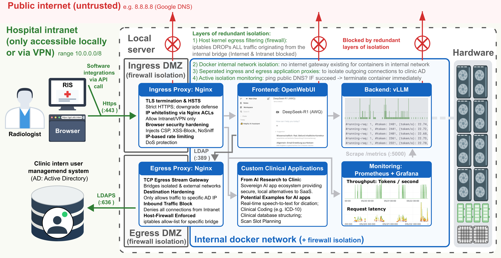

# UKB-GPT

Single-host, isolation-first GenAI stack for sensitive data processing. This repository is for running local chat, embedding, and STT backends with strict network isolation and pinned egress exceptions only where explicitly configured.




Read the [disclaimer](docs/disclaimer.md) and [security risk assessment](docs/risk_assessment.md) first.

**By cloning, forking, or running this software, you acknowledge that you have read this [disclaimer](docs/disclaimer.md) and agree to use the software at your own risk.**

## Quick Start

Set up the local Python environment once:

```bash
python3 -m venv .venv
./.venv/bin/python -m pip install -U pip
./.venv/bin/python -m pip install -r requirements.txt
```

Fastest safe path:

```bash
python3 start.py wizard
python3 start.py up
```

What the wizard does:

- writes non-secret settings to `.env`
- keeps secrets out of `.env`
- helps you choose runtime mode, optional features/apps, and backend deployments

Before startup, make sure model artifacts already exist locally. Normal runtime downloads are not part of the intended path.

## Repository Structure

The tree below is a guided overview of the main tracked files and folders. Runtime-generated artifacts such as `compose/generated/` are intentionally omitted.

```text
.
├── README.md                                     # Main project overview and quick start
├── LICENSE                                       # License terms for the repository
├── .gitignore                                    # Ignore rules for local and generated artifacts
├── requirements.txt                              # Shared Python dependencies for CLI tools and tests
├── pytest.ini                                    # Pytest collection, path, and marker configuration
├── start.py                                      # Main CLI for the wizard, validation, and startup
├── stop.py                                       # Shutdown helper for the Compose project
├── apps/                                         # App-specific source trees for optional add-ons
│   ├── dictation/                                # Gradio speech-to-text app exposed via ingress
│   │   ├── app.py                                # Dictation application entrypoint
│   │   ├── Dockerfile                            # Image build recipe for the dictation app
│   │   ├── requirements.txt                      # Python dependencies for the dictation app
│   │   ├── translate_prompt.txt                  # Prompt template used during transcription flow
│   │   └── README.md                             # Dictation-specific usage notes
│   ├── cohort_feasibility/                       # Placeholder folder for the cohort feasibility app
│   │   └── README.md                             # Temporary note until app materials are published
│   ├── dataset_structuring/                      # Placeholder folder for dataset structuring assets
│   │   └── README.md                             # Temporary note until app materials are published
│   └── icd_10_coding/                            # Placeholder folder for the ICD-10 coding app
│       └── README.md                             # Temporary note until app materials are published
├── compose/                                      # Compose base files and overlays that assemble the stack
│   ├── base.yml                                  # Core services, networks, and baseline runtime wiring
│   ├── hardening.yml                             # Shared hardening defaults extended by other services
│   ├── model.base.yml                            # Common worker template for rendered model deployments
│   ├── schema.toml                               # Central env schema used by the wizard and docs tooling
│   ├── modes/                                    # Runtime-mode overlays
│   │   ├── frontend.provider.yml                 # Chatbot-provider mode with frontend-facing services
│   │   └── batch.client.yml                      # Batch-client mode for localhost API access
│   ├── features/                                 # Optional feature overlays layered onto a mode
│   │   ├── ldap.yml                              # LDAP authentication integration
│   │   ├── api_egress.yml                        # Pinned upstream API egress routing
│   │   ├── metrics.yml                           # Prometheus and Grafana observability services
│   │   ├── chat_purger.yml                       # Automated OpenWebUI chat retention cleanup
│   │   ├── rate_limiting.yml                     # Adaptive rate-limiting pipeline support
│   │   ├── embedding_backend.yml                 # Optional embedding backend wiring
│   │   ├── stt_backend.yml                       # Optional speech-to-text backend wiring
│   │   └── dmz_egress.yml                        # Extra DMZ egress handling for outbound traffic
│   ├── apps/                                     # Compose overlays for optional application services
│   │   ├── dictation.yml                         # Dictation app service overlay
│   │   ├── cohort_feasibility.yml                # Cohort feasibility app service overlay
│   │   └── dataset_structuring.yml               # Dataset structuring utility app overlay
│   └── models/                                   # Model catalog and per-family compose templates
│       ├── README.md                             # Model zoo reference and deployment conventions
│       ├── backend_router.yml                    # Shared router used in front of model workers
│       ├── llm/                                  # LLM family templates and metadata
│       │   └── <family>/                         # One folder per LLM family with `base.yml` and `model.toml`
│       ├── embedding/                            # Embedding family templates and metadata
│       │   └── <family>/                         # One folder per embedding family with `base.yml` and `model.toml`
│       ├── stt/                                  # STT family templates and metadata
│       │   └── <family>/                         # One folder per STT family with `base.yml` and `model.toml`
│       └── testing/                              # Mock/lightweight model families used by tests
│           └── <family>/                         # Test-only fake backend definitions
├── docs/                                         # Operator, feature, app, and developer documentation
│   ├── README.md                                 # Main operator documentation hub
│   ├── setup-basics.md                           # Common setup and prerequisite guide
│   ├── lifecycle.md                              # Runtime checks, logs, and shutdown guide
│   ├── disclaimer.md                             # Legal usage terms, warranty disclaimer, and liability limits
│   ├── risk_assessment.md                        # Security posture, trust boundaries, residual risks, and audit focus
│   ├── diagram.png                               # Architecture diagram shown in this README
│   ├── modes/                                    # Detailed runtime-mode documentation
│   │   ├── chatbot-provider.md                   # WebUI and HTTPS deployment guide
│   │   └── batch-client.md                       # Localhost API deployment guide
│   ├── features/                                 # Docs for optional stack features
│   │   └── *.md                                  # One page per feature such as LDAP or metrics
│   ├── apps/                                     # Docs for optional apps
│   │   └── *.md                                  # One page per app such as dictation
│   └── dev/                                      # Contributor docs for extending the stack
│       ├── README.md                             # Entry point for developer-facing docs
│       └── *.md                                  # Guides for apps, model families, and extensions
├── images/                                       # Docker image build contexts and runtime helper assets
│   ├── nginx/                                    # Hardened Nginx images for ingress, routing, and egress
│   │   ├── ingress/                              # Main inbound proxy config and templates
│   │   ├── backend_router/                       # Internal router in front of model workers
│   │   ├── api_egress/                           # Allowlisted egress proxy for upstream APIs
│   │   └── ldap_egress/                          # Allowlisted egress proxy for LDAP traffic
│   ├── openwebui/                                # Customized OpenWebUI image plus pipeline helpers
│   │   ├── pipelines/                            # Custom OpenWebUI pipeline implementations
│   │   └── functions/                            # Custom OpenWebUI function snippets
│   ├── metrics/                                  # Assets for Prometheus, Grafana, and exporters
│   │   ├── prometheus/                           # Prometheus image and generated-config template
│   │   ├── grafana/                              # Grafana image and dashboard provisioning
│   │   └── exporter/                             # Metrics exporter image context
│   ├── vllm_worker/                              # Primary worker image for model-serving containers
│   └── dummy_vllm_worker/                        # Minimal fake worker image used by tests
├── security_helpers/                             # Host-side scripts that enforce and inspect isolation
│   ├── apply_host_firewall.py                    # Applies host firewall rules for network isolation
│   ├── install_security_helpers.sh               # Installs helper scripts on the host
│   ├── active_isolation_monitoring_entrypoint.sh # Runtime monitor for isolation enforcement
│   ├── check_egress.sh                           # Helper for validating outbound connectivity rules
│   ├── healthcheck.sh                            # Shared healthcheck script for hardened containers
│   └── nginx_debug_dump.sh                       # Troubleshooting helper for Nginx runtime config
├── tests/                                        # Managed-stack integration and isolation test suite
│   ├── README.md                                 # Testing model, markers, and common commands
│   ├── conftest.py                               # Shared fixtures that boot and tear down test stacks
│   ├── helpers/                                  # Test helpers for Docker, PKI, networking, and fixtures
│   ├── integration/                              # End-to-end behavior tests across runtime modes
│   ├── isolation/                                # Security-boundary and hardening regression tests
│   ├── model_deployments/                        # Sample deployment TOMLs used by tests
│   ├── compose.test.*.yml                        # Compose fragments for test-only helpers and mocks
│   └── mock_api_server_entrypoint.sh             # Entrypoint for the mock upstream API in tests
└── utils/                                        # Shared Python modules behind startup and generation tools
    ├── stack/                                    # Core stack orchestration logic used by the CLI
    │   ├── startup.py                            # Wizard, validation, and Compose startup orchestration
    │   ├── schema.py                             # Parser/loader for `compose/schema.toml`
    │   └── deployments.py                        # Rendering and resolution of concrete model deployments
    ├── models/                                   # Model deployment parsing and topology helpers
    │   └── deployment.py                         # TOML parser and resolver for deployment configs
    └── scripts/                                  # Standalone helper scripts
        ├── build_docs.py                         # Generates docs from schema and model metadata
        ├── configure_env.py                      # Standalone entrypoint for the interactive `.env` wizard
        └── create_localhost_pki.py               # Creates localhost certificates for local runs and tests
```

## Where To Go Next

- New operator: [Operational docs hub](docs/README.md)
- Common prerequisites and backend selection: [Common setup](docs/setup-basics.md)
- Tests: [tests/README.md](tests/README.md)
- Security disclosure: [SECURITY.md](SECURITY.md)

## Useful Commands

```bash
python3 start.py validate
python3 start.py wizard --start
python3 start.py up --env-file /path/to/.env
python3 stop.py
```

Secrets can be exported in the shell or provided via `*_FILE` variables such as `CERTIFICATE_KEY_FILE`. Do not set both `VAR` and `VAR_FILE` for the same secret.

## Citation

If you use this repository or its architecture in your research, please cite our paper:

**Secure On-Premise Deployment of Open-Weights Large Language Models in Radiology: An Isolation-First Architecture with Prospective Pilot Evaluation**  
*Sebastian Nowak, Jann-Frederick Laß, Narine Mesropyan, Babak Salam, Nico Piel, Wolfgang Block, Alois Martin Sprinkart, Alexander Isaak, Benjamin Wulff, Julian Alexander Luetkens*  
arXiv preprint, 2026. *(arXiv ID coming soon)*
